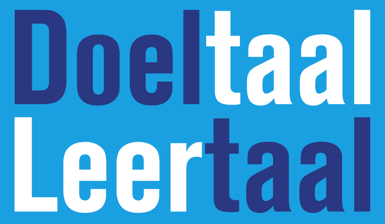

* [Home](/)
* [Over Doeltaal-Leertaal](/achtergrondinformatie)
* [Cursussen](/cursussen)
* [Links en werkvormen](/linksenwerkvormen)
 
 
 

Iedere vreemdetalendocent kan de doeltaal leerzaam leren inzetten. Alleen, effectief doeltaalgebruik vergt wel didactische kennis, oefening én taalbewustzijn. Dat laatste houdt in dat de docent tijdens het gebruik van de doeltaal veelvuldig en bewust strategieën inzet om met behulp van zijn taalgebruik de leerlingen meteen van alles te laten leren. Het aanleren van deze strategieën, de lessen ermee voorbereiden en evalueren is aan het begin niet eenvoudig. Ben je eenmaal bekend met, én geoefend in, die strategieën, dan wil je niet meer zonder en vraag je je af waarom je vroeger ‘zomaar intuïtief de doeltaal gebruikte’. 

Om goed bedreven te raken met Doeltaal-Leertaal zijn er verschillende cursussen en workshops beschikbaar. Een korte beschrijving per aanbod is hieronder te vinden. Alle cursussen worden op locatie gegeven (of in overleg op inschrijving op een centrale plek in het land, waar docenten van verschillende scholen naartoe kunnen komen). 

### CURSUSAANBOD DOELTAAL-LEERTAAL

***Workshop doeltaal-leertaal***

In deze workshop maken deelnemers kennis met doeltaal-leertaal. De nadruk ligt op het ervaren van de didactiek, zowel als leerling als in de docentenrol. Deelnemers krijgen daarbij alvast een korte inkijk in de theorie die achter doeltaal-leertaal schuilgaat, ze zien videomateriaal van docenten die de doeltaal effectief inzetten, ondergaan de didactiek zelf en oefenen er al meteen mee. De workshop brengt doeltaal-leertaal levendig in kaart en geeft een beeld van de mogelijke vervolgstappen voor docenten en scholen om de doeltaal effectiever te leren inzetten.

***Basiscursus doeltaal-leertaal***

Tijdens de basiscursus doeltaal-leertaal krijgen deelnemers een compleet beeld van de didactiek. Zij bouwen samen klassenroutines op, leren doeltaal-leertaal kwalitatief te observeren en in te zetten, gaan op lesbezoek en leggen hun eigen handelen op video vast, maken kennis met achterliggende theorieën en lezen achtergrondliteratuur, en ervaren tijdens de cursus allerlei werkvormen die direct tijdens hun lessen kunnen worden ingezet. De cursus is erop gericht dat de klassenpraktijk van de deelnemende docenten een direct verlengstuk is van de cursus en vice versa. 
Aan de basiscursus kunnen circa 18 docenten deelnemen. De cursus bestaat uit twee hele dagen en een tussenliggende halve dag en kan gevolgd worden door docenten van alle vreemde talen (dus ook van het vak Engels ). Vanzelfsprekend is er in aanloop naar de cursus nog afstemming over de precieze invulling van de cursus en de werkwijze zodat de school goed op de hoogte is van het gebodene en er eventueel op maat aanpassingen getroffen kunnen worden. 

***Intensieve cursus doeltaal-leertaal***

Het eerste deel van de intensieve cursus doeltaal-leertaal wordt in principe gevormd door de basiscursus. Vervolgens wordt daaraan verdieping toegevoegd in de vorm van drie extra cursusdagen. Deze drie cursusdagen worden in overleg met de school/docenten ingevuld, maar hebben in de meeste gevallen de volgende bestanddelen: een observatiedag, een verdiepingsdag en een video-interactiedag.  
Tijdens de observatiedag gaan docenten in wisselende samenstellingen (samen met de trainer) bij elkaar op lesbezoek. De dag wordt afgesloten met een gezamenlijke evaluatie waarin inzichten en leerwensen worden vastgesteld. De verdiepingsdag volgt kort op de observatiedag en staat in het teken van actieve scholing, gebaseerd op de observaties, inzichten en leerwensen die voortkwamen uit de observatiedag, en natuurlijk de didactische expertise van de trainer. Na de verdiepingsdag gaan alle deelnemers met een concreet leerplan naar huis, waaraan ze gedurende twee schoolweken zullen werken. Van hun bevindingen maken ze videoregistraties die de kern vormen van de slotsessie, de video-interactiedag.
De intensieve cursus (basiscursus + verdieping) kan in zijn geheel worden afgenomen, of los als verdiepingsmodule worden toegevoegd aan de basiscursus. 

***Doeltaal-leertaal - Coaching op de werkvloer***

Tijdens de bovenbeschreven cursussen wordt, door middel van videoreflectie, voorbeeldlessen en veel oefenen, voortdurend de relatie gelegd tussen de theorie en de praktijk van het doeltaalgebruik. Extra (of los in te zetten) begeleiding op de werkvloer kan daarbij voor grote leerstappen zorgen. Dit betekent: lesobservaties, feedback, samen met de trainer lessen voorbereiden en teamteachen. 
Coaching op de werkvloer is geschikt voor docenten die in elk geval aan de basiscursus hebben deelgenomen en kan zowel door individuele docenten als door kleine groepjes (maximaal 4) worden gevolgd. 
 
 

### ANDERE SCHOLING EN BEGELEIDING

***(vak)Didactische nascholing of persoonlijke begeleiding***

Als ervaren lerarenopleider, docent en coach geef ik veelvuldig nascholing en begeleiding. Hieronder staan enkele opties. Alle trajecten vinden in afstemming met de school plaats, geen cursus is hetzelfde. Laat dus vooral weten wat de wensen zijn, dan stemmen we af en bespreken wat ik kan betekenen. Indien een vraag niet binnen mijn expertisegebied ligt, zal ik het ook altijd melden (en eventueel doorverwijzen naar een collega). 
Opties voor nascholing en begeleiding:
-	Vakdidactische nascholing moderne vreemde talen (van een middag over een specifiek onderwerp tot langere trajecten of vakdidacticus in residence, voor mogelijke onderwerpen zie: S. Dönszelmann, C. van Beuningen, A. Kaal & R. de Graaff (red.) (2020). Handboek vreemdetalendidactiek: Vertrekpunten, vaardigheden, vakinhoud. Bussum: Coutinho.
-	Sectiebegeleiding (het kan zowel vakinhoudelijke scholing betreffen of coaching wanneer er bijvoorbeeld professionele frictie binnen de sectie ontstaan is)
-	Individuele vakdidactische begeleiding of coaching
-	Training voor beginnende mentoren in het VO
-	Training klassenmanagement in het VO

***Dagvoorzitterschap, studiedag of conferentie***

Bij het organiseren van een conferentie of seminar is het prettig om te kunnen samenwerken. Hoe kunnen doelen op het gebied van professionalisering werkelijk worden bereikt, hoe blijft een gehele conferentiedag aansprekend en activerend, hoe voorkom je versnippering en hoe kunnen opbrengsten duurzaam verankerd worden binnen de schoolontwikkeling? Dergelijke vragen onderstrepen het belang van expertise op het gebied van professionalisering in het onderwijs. 
	Op zoek naar een dagvoorzitter voor een conferentie, iemand om een studiedag of professionaliseringstraject mee vorm te geven, of beide: neem vooral contact op, voor alles van brainstorm tot uitvoering. Ook een dagvoorzitterschap van al bestaande conferentie behoort tot de mogelijkheden.

