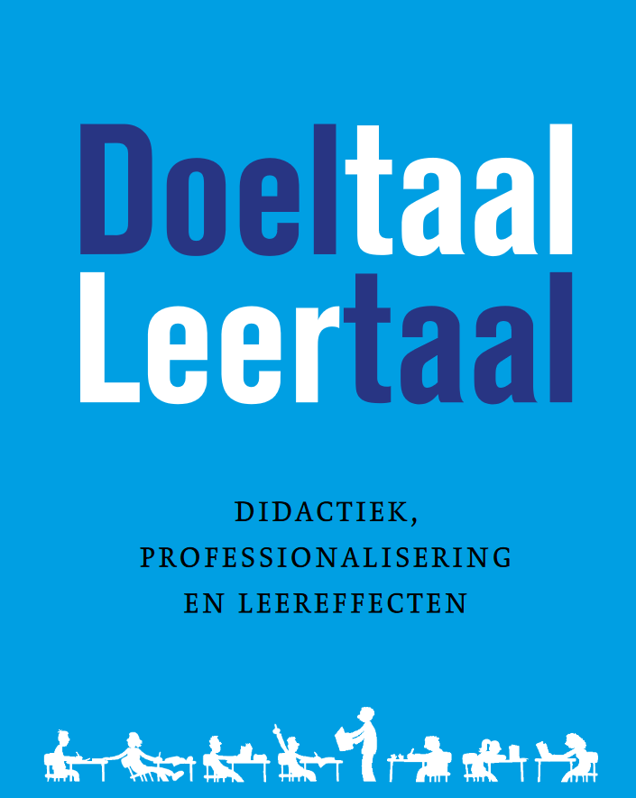

<head>
    <meta charset="utf-8">
    <meta name="Description" CONTENT="Doeltaal-Leertaal cursussen over doeltaal en voertaal. Sebastiaan Dönszelmann, vrije universiteit vu onderzoek">
<!--     <meta name="google-site-verification" content="+nxGUDJ4QpAZ5l9Bsjdi102tLVC21AIh5d1Nl23908vVuFHs34="/> -->
    <title>Doeltaal-Leertaal</title>
    <meta name="robots" content="noindex,nofollow">
</head>

Heeft u vragen? Mail naar [info@doeltaal-leertaal.nl](mailto://info@doeltaal-leertaal.nl).  

 

* [Home](/)
* [Over Doeltaal-Leertaal](/achtergrondinformatie)
* [Cursussen](/cursussen)
* [Links en werkvormen](/linksenwerkvormen)

---

Deze website is nog in aanbouw.

